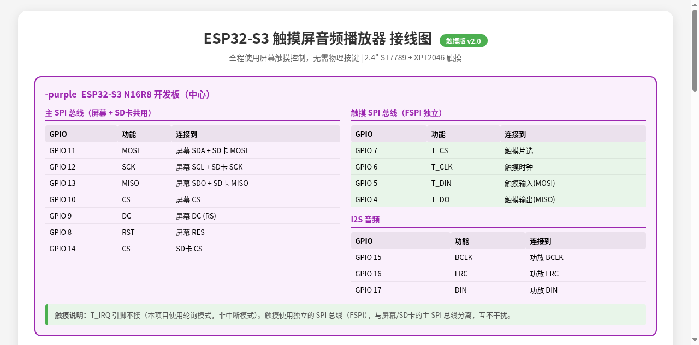

# ESP32-S3 触摸屏音频播放器 — 从零搭建教程

> 硬件清单：ESP32-S3 N16R8 + 2.4" ILI9341 TFT 240×320 屏幕（带XPT2046触摸）+ MAX98357A 功放 + Mini SD卡模块 + 28mm 4Ω3W 喇叭 + 面包板 + 杜邦线
> 全程触摸控制，无需物理按键！支持蓝牙传歌：通过手机 APP 经 BLE（低功耗蓝牙）将 MP3 文件无线传输到 SD 卡
> ⚠️ 重要：ESP32-S3 不支持经典蓝牙（SPP），本项目改用 BLE（低功耗蓝牙），使用 Nordic UART Service 协议

---

## 第一步：安装 Arduino IDE

1. 打开 https://www.arduino.cc/en/software 下载 **Arduino IDE 2.x**（Windows/Mac/Linux 均可）
2. 安装并打开

---

## 第二步：添加 ESP32 开发板支持

1. 打开 Arduino IDE → 菜单 **文件 → 首选项**
2. 在「附加开发板管理器网址」中填入：
   ```
   https://espressif.github.io/arduino-esp32/package_esp32_index.json
   ```
3. 点击「确定」保存
4. 菜单 **工具 → 开发板 → 开发板管理器**
5. 搜索 `esp32`，找到 **esp32 by Espressif Systems**，点击「安装」（安装最新版即可）
6. 安装完成后，菜单 **工具 → 开发板 → esp32** → 选择 **ESP32S3 Dev Module**

---

## 第三步：安装依赖库

菜单 **工具 → 管理库**，分别搜索并安装以下三个库：

### 1. TFT_eSPI（屏幕驱动）
- 搜索 `TFT_eSPI`
- 作者：**Bodmer**
- 点击「安装」（选择最新版）

### 2. ESP32-audioI2S（音频解码）
- 搜索 `ESP32-audioI2S`
- 作者：**schreibfaul1**
- 点击「安装」（选择最新版）

> 注意：如果搜索不到 ESP32-audioI2S，可以在库管理器中搜索 `audio i2s`，或者手动从 GitHub 下载：https://github.com/schreibfaul1/ESP32-audioI2S

### 3. XPT2046_Touchscreen（触摸驱动）⚠️ 触摸版必需
- 搜索 `XPT2046_Touchscreen`
- 作者：**Paul Stoffregen**
- 点击「安装」（选择最新版）

> 这个库负责驱动屏幕的 XPT2046 触摸控制器，没有它触摸功能无法工作。

---

## 第四步：配置 TFT_eSPI（关键步骤！）

这一步最容易出错，请仔细操作。

### 找到配置文件

**Windows:**
```
C:\Users\你的用户名\Documents\Arduino\libraries\TFT_eSPI\User_Setup.h
```

**Mac:**
```
~/Documents/Arduino/libraries/TFT_eSPI/User_Setup.h
```

### 替换文件内容

用文本编辑器打开 `User_Setup.h`，**清空全部内容**，粘贴以下代码：

```cpp
#define USER_SETUP_INFO "ESP32-S3 ILI9341 240x320 Touch"

// 驱动芯片
#define ILI9341_2_DRIVER
#define TFT_WIDTH  240
#define TFT_HEIGHT 320

// ESP32-S3 引脚映射
#define TFT_MOSI 11
#define TFT_SCLK 12
#define TFT_CS   10
#define TFT_DC    9
#define TFT_RST   8

// 如果屏幕颜色不对（红色变蓝色），取消下面这行的注释
// #define TFT_RGB_ORDER TFT_BGR

// 加载字体
#define LOAD_GLCD
#define LOAD_FONT2
#define LOAD_FONT4
#define LOAD_FONT6
#define LOAD_FONT7
#define LOAD_FONT8
#define LOAD_GFXFF
#define SMOOTH_FONT

// SPI 速度（40MHz，稳定可靠）
#define SPI_FREQUENCY  40000000
// 触摸使用独立SPI总线(FSPI)，不需要在这里配置触摸引脚
```

保存文件。如果 IDE 正在运行，重启 Arduino IDE。

---

## 第五步：接线

### 总览图

```
                    ┌──────────────────────┐
                    │    ESP32-S3 开发板    │
                    │                      │
   ILI9341 屏幕 ──── │  GPIO8  = RES        │
   (含触摸)    ──── │  GPIO4-7 = 触摸SPI   │
   MAX98357A  ──── │  GPIO15-17 = I2S音频  │
   SD卡模块   ──── │  GPIO13 = MISO(共用)  │
                    │  GPIO14 = CS(SD)     │
                    │  (无物理按键!)        │
                    └──────────────────────┘
```

### 接线图



### 详细接线表

#### 1. 屏幕（2.4" ILI9341 TFT + XPT2046触摸，14个引脚）

| 屏幕引脚 | ESP32-S3 引脚 | 杜邦线颜色（建议） | 说明 |
|---|---|---|---|
| VCC | 3.3V | 红色 | 电源 |
| GND | GND | 黑色 | 地 |
| SCL (SCK) | GPIO12 | 黄色 | 主SPI时钟 |
| SDA (MOSI) | GPIO11 | 蓝色 | 主SPI数据 |
| RES (RST) | GPIO8 | 白色 | 屏幕复位 |
| DC (RS) | GPIO9 | 绿色 | 数据/命令 |
| CS | GPIO10 | 橙色 | 屏幕片选 |
| SDO (MISO) | GPIO13 | 紫色 | 主SPI读回 |
| LED (背光) | 3.3V | 红色 | 背光常亮 |
| **T_CS** | **GPIO7** | **浅绿** | **触摸片选** |
| **T_CLK** | **GPIO6** | **青色** | **触摸时钟** |
| **T_DIN** | **GPIO5** | **金黄** | **触摸数据输入** |
| **T_DO** | **GPIO4** | **棕色** | **触摸数据输出** |
| T_IRQ | 不接 | - | 轮询模式，无需中断 |

> **重要：触摸引脚（绿色行）必须接线！**
> - 触摸使用独立的 SPI 总线（FSPI），与屏幕/SD卡的主 SPI 总线分离
> - T_IRQ 引脚不接（本项目使用轮询模式检测触摸）
> - 之前的物理按键版不需要接这些引脚，触摸版必须接上

#### 2. 音频功放（MAX98357A，7个引脚）

| 功放引脚 | ESP32-S3 引脚 | 说明 |
|---|---|---|
| VIN | 5V (推荐) | 供电，5V声音更大更稳定 |
| GND | GND | 地 |
| BCLK | GPIO15 | 位时钟 |
| LRCLK (LRC) | GPIO16 | 左右声道时钟 |
| DIN | GPIO17 | 数据输入 |
| GAIN | 不接 | 使用默认增益 |
| SD | 不接 | 闲置 |

> 喇叭接线：28mm 4Ω3W 喇叭的两根线接到功放模块上的**绿色端子**（SPK+ 和 SPK-），不分正负。

#### 3. SD卡模块（6个引脚）

| SD模块引脚 | ESP32-S3 引脚 | 说明 |
|---|---|---|
| VCC (3.3V) | 3.3V | 供电 |
| GND | GND | 地 |
| MISO | GPIO13 | 数据输出（与屏幕 SDO 共用） |
| MOSI | GPIO11 | 数据输入（与屏幕 SDA 共用） |
| SCK | GPIO12 | 时钟（与屏幕 SCL 共用） |
| CS | GPIO14 | 片选（独立） |

> SD卡与屏幕**共享主SPI总线**（MOSI/SCK/MISO），通过不同的CS片选区分。触摸使用独立总线，互不干扰。

### 电源注意事项

- ESP32-S3 的 3.3V 引脚**同时给屏幕、SD卡、功放供电**
- 如果功放声音太大导致重启，改用 **5V** 给功放 VIN 供电
- 确保所有模块的 **GND 连在一起**（共地）

---

## 第六步：准备 SD 卡

1. 取一张 Micro SD 卡（8GB/16GB 均可）
2. 用电脑格式化为 **FAT32** 格式：
   - Windows：右键 SD 卡盘 → 格式化 → 文件系统选 FAT32
   - Mac：磁盘工具 → 抹掉 → MS-DOS (FAT)
3. 将 MP3/WAV/FLAC 文件直接复制到 SD 卡**根目录**（不要放子文件夹）
4. 插入 SD 卡模块

> 建议：先用 3-5 首 MP3 测试，确认能播放后再多放。

---

## 第七步：烧录代码

1. 用 **USB Type-C 线**连接 ESP32-S3 到电脑
2. 在 Arduino IDE 中打开 `ESP32_S3_Audio_Player.ino`
3. 菜单 **工具** 确认以下设置：

| 设置项 | 值 |
|---|---|
| 开发板 | ESP32S3 Dev Module |
| USB Mode | USB-OTG (TinyUSB) |
| Upload Mode | UART0 / Hardware CDC |
| Flash Size | 16MB (128Mb) |
| PSRAM | OPI PSRAM 8MB |
| Partition Scheme | **Huge APP (3MB No OTA/1MB SPIFFS)** |
| Port | 选择对应的 COM 口或串口设备 |

4. 点击左上角 **→ 上传按钮**（箭头图标）
5. 等待编译和上传完成（底部状态栏显示「上传完成」）

> 如果上传失败，按住 ESP32-S3 板上的 **BOOT 按钮**，然后按一下 **RST 按钮**，松开 BOOT，重新上传。

---

## 第八步：使用说明

### 开机流程

1. 上电后屏幕显示「初始化中...」
2. 检测 SD 卡，显示「SD卡OK」
3. 扫描音频文件
4. 进入文件列表界面（可显示 10 首歌曲）
5. 用手指触摸屏幕操作，无需任何按键！

### 列表界面（240×320 触摸版）

```
┌────────────────────────┐
│ 音乐 1/12    BT  PLAY  │  ← 标题栏（时钟+蓝牙+播放指示）
│              2026.7.26  │  ← 年月日（蓝牙同步后显示）
├────────────────────────┤
│ 01 song_name           │  ← 蓝色高亮 = 当前选中
│ 02 song_name           │
│ 03 song_name        >  │  ← 绿色 > = 正在播放
│ 04 song_name           │
│ 05 song_name           │     ↑ 点击歌曲名 = 选中
│ 06 song_name           │     ↑ 再点一次选中歌曲 = 播放
│ 07 song_name           │
│ 08 song_name           │     ↑ 上半空白区域 = 向上翻页
│ 09 song_name           │     ↓ 下半空白区域 = 向下翻页
│ 10 song_name          ▐│  ← 右侧滚动条
├────────────────────────┤
│   UP    |   PLAY   | DOWN │  ← 底部触摸按钮栏
└────────────────────────┘
```

| 触摸操作 | 功能 |
|---|---|
| **点击歌曲名** | 选中该歌曲（蓝色高亮） |
| **再次点击选中歌曲** | 开始播放，进入播放界面 |
| **点击底部 UP** | 选中上一首 |
| **点击底部 PLAY** | 播放当前选中歌曲 |
| **点击底部 DOWN** | 选中下一首 |
| **点击上半空白区** | 向上翻页 |
| **点击下半空白区** | 向下翻页 |

### 播放界面（240×320 触摸版）

```
┌────────────────────────┐
│ < List       Playing   │  ← 左上角"< List"= 返回列表
│ ─────────────────────  │
│                        │
│    song_name           │  ← 歌曲名（白色，不带后缀）
│                        │
│      > PLAY            │  ← 播放状态（绿色大字）
│                        │
│  ▓▓▓▓▓░░░░░░░░░░░░░░  │  ← 进度条（青色）
│  00:32          03:45  │  ← 当前时间 / 总时长
│                        │
│  VOL: 12/21            │  ← 音量
│  ▓▓▓▓▓▓▓▓░░░░░░░░░░░  │  ← 音量条
│                        │
│  (O)  (O)  ( O )  (O)  (O) │  ← 5个圆形触摸按钮
│ PREV  V-  PLAY/PAUSE V+  NEXT │
├────────────────────────┤
│  tap buttons to control │
└────────────────────────┘
```

| 触摸操作 | 功能 |
|---|---|
| **点击左上角 "< List"** | 返回文件列表 |
| **点击 PREV 按钮** | 上一首 |
| **点击 V- 按钮** | 音量减 |
| **点击 PLAY/PAUSE 按钮** | 播放 / 暂停 |
| **点击 V+ 按钮** | 音量加 |
| **点击 NEXT 按钮** | 下一首 |

### 播放结束

- 当前歌曲播放完毕后**自动播放下一首**
- 列表循环（最后一首播完回到第一首）

---

## 常见问题排查

### 问题1：屏幕不显示 / 全黑

| 检查项 | 操作 |
|---|---|
| 接线 | 确认 VCC 接 3.3V，GND 接地 |
| 引脚 | 确认 SCL→GPIO12, SDA→GPIO11, DC→GPIO9, RES→GPIO8, CS→GPIO10 |
| User_Setup.h | 确认已正确配置（见第四步），特别是 TFT_HEIGHT=320 |
| LED 背光 | 确认 LED 接了 3.3V（2.4寸屏幕背光引脚是 LED 不是 BLK） |

### 问题2：屏幕颜色不对（红蓝反转）

打开 `User_Setup.h`，取消这行注释：
```cpp
#define TFT_RGB_ORDER TFT_BGR
```
重新上传代码。

### 问题3：触摸无反应 ⚠️ 触摸版常见

| 检查项 | 操作 |
|---|---|
| 库安装 | 确认已安装 XPT2046_Touchscreen 库（Paul Stoffregen） |
| 接线 | 确认 T_CS→GPIO7, T_CLK→GPIO6, T_DIN→GPIO5, T_DO→GPIO4 |
| T_IRQ | T_IRQ 引脚应不接（悬空） |
| 校准 | 触摸坐标可能不准，需调整代码中 `getTouchPoint()` 的 map() 校准值 |
| 串口 | 打开串口监视器(115200)，触摸时应有 `[Touch] x= y=` 输出 |

> **触摸校准方法**：打开串口监视器，用笔点击屏幕四个角，观察输出的 x/y 坐标。修改代码第 223-225 行的 `map()` 参数：
> ```cpp
> tx = map(p.x, 200, 3700, 0, SCREEN_W);  // 调整 200 和 3700
> ty = map(p.y, 240, 3800, 0, SCREEN_H);  // 调整 240 和 3800
> ```

### 问题4：没有声音

| 检查项 | 操作 |
|---|---|
| 功放接线 | 确认 BCLK→GPIO15, LRCLK→GPIO16, DIN→GPIO17 |
| 喇叭接线 | 确认喇叭线接在 MAX98357A 的绿色端子上 |
| 音量 | 确认音量不为 0（播放界面点击 V+ 按钮加音量） |
| 供电 | 功放 VIN 接 5V 试试（3.3V 可能供电不足） |

### 问题5：SD卡读取失败

| 检查项 | 操作 |
|---|---|
| 格式 | 确认 SD 卡是 **FAT32** 格式（不是 exFAT 或 NTFS） |
| 接线 | 确认 CS→GPIO14, MISO→GPIO13（与屏幕 SDO 共用） |
| 卡片 | 换一张卡试试，有些劣质卡兼容性差 |
| 模块 | 确认买的是 3.3V 模块，不是 5V 版本 |

### 问题6：编译报错

| 错误信息 | 解决方案 |
|---|---|
| `TFT_eSPI.h: No such file` | 确认已安装 TFT_eSPI 库 |
| `Audio.h: No such file` | 确认已安装 ESP32-audioI2S 库 |
| `XPT2046_Touchscreen.h: No such file` | 确认已安装 XPT2046_Touchscreen 库（Paul Stoffregen） |
| `ST7789_DRIVER not defined` | 确认 User_Setup.h 配置正确，改用 `ILI9341_2_DRIVER` |
| 内存不足 | 菜单 工具 → Partition Scheme → 选 `Huge APP (3MB No OTA/1MB SPIFFS)` |
| PSRAM 相关错误 | 确认 工具 → PSRAM → 选 `OPI PSRAM 8MB` |

### 问题7：上传失败 / 无法连接

| 检查项 | 操作 |
|---|---|
| USB 线 | 确认是**数据线**不是充电线 |
| 端口 | 确认 工具 → Port 选了正确的串口 |
| BOOT 模式 | 按住 BOOT → 按一下 RST → 松开 BOOT → 重新上传 |
| 驱动 | 如果电脑没识别到串口，安装 CH340/CP2102 驱动 |

---

## 第九步：蓝牙传歌功能（BLE版）

ESP32-S3 **不支持经典蓝牙（SPP）**，因此本项目使用 **BLE（低功耗蓝牙）** 通过 Nordic UART Service 协议传输文件。手机通过 APP 可将 MP3 文件无线传输到 SD 卡。

### 传输流程

```
手机选择MP3文件 → BLE GATT连接 → Nordic UART透传 → ESP32写入SD卡 → 自动刷新列表
```

### 蓝牙设备名

ESP32 上电后 BLE 自动启动，设备名为 **ESP32_MusicBox**，在手机 APP 中扫描该名称即可连接。

> 注意：BLE 设备**不会**出现在手机系统的蓝牙设置配对列表中（那是经典蓝牙的），必须通过 **ESP32 MusicBox APP** 扫描连接。

### BLE 服务与特征值

| 名称 | UUID | 说明 |
|---|---|---|
| Nordic UART Service | `6e400001-b5a3-f393-e0a9-e50e24dcca9e` | 透传服务 |
| RX 特征值（手机→ESP32） | `6e400002-b5a3-f393-e0a9-e50e24dcca9e` | 手机写入数据 |
| TX 特征值（ESP32→手机） | `6e400003-b5a3-f393-e0a9-e50e24dcca9e` | ESP32通知回复 |

### 传输协议

```
手机 → ESP32 (通过BLE写入RX特征值):
  [0xAB] [文件名 UTF-8] [0x00] [文件大小 4字节小端] [文件内容 N字节]
ESP32 → 手机 (通过BLE TX特征值通知):
  收到完整文件后回复 "OK\n"，出错回复 "ERR\n"
```

> BLE 每次写入最多 244 字节（MTU=247，减去3字节ATT头），APP 会自动分片发送。

### 蓝牙遥控命令

在未传输文件时，手机可发送单字节命令控制播放：

| 命令字节 | 功能 | ESP32 回复 |
|---|---|---|
| 0xC0 | 播放/暂停 | OK\n |
| 0xC1 | 上一首 | OK\n |
| 0xC2 | 下一首 | OK\n |
| 0xC3 | 音量+ | OK\n |
| 0xC4 | 音量- | OK\n |
| 0xC5 | 获取状态 | JSON 状态字符串\n |

### 蓝牙时间同步

| 命令 | 格式 |
|---|---|
| 0xD0 + 时间戳 | [0xD0] [4字节 Unix时间戳大端序] |

同步后列表界面右上角显示时钟和年月日。

### ESP32 端传输界面

传输过程中 ESP32 屏幕自动切换到接收界面，显示：
- 文件名
- 进度条和百分比（大号字体）
- 已接收 / 总大小
- 传输完成后 2 秒自动返回列表

> 注意：传输中可**触摸屏幕任意位置**取消接收。BLE 传输速度约 10-20 KB/s，一首 5MB MP3 约需 5-8 分钟。

### 编译蓝牙版代码的重要设置

蓝牙功能需要更多 Flash 空间，必须在 Arduino IDE 中调整：

| 设置项 | 值 |
|---|---|
| Partition Scheme | **Huge APP (3MB No OTA/1MB SPIFFS)** |
| PSRAM | **OPI PSRAM 8MB** |

否则会报编译内存不足错误。

---

## 第十步：使用 Android APP 传歌

### 方法一：编译 Android APP（推荐）

项目位于 `AndroidApp/` 目录，使用 **Android Studio** 打开。

1. 安装 Android Studio（https://developer.android.com/studio）
2. 打开 `ESP32_Audio_Player/AndroidApp/` 目录
3. 等待 Gradle 同步完成
4. 连接手机（开发者模式 + USB调试）
5. 点击绿色 ▶ 按钮编译并安装到手机

### 方法二：手机直接编译（无需电脑）

详见 `AndroidApp/手机编译APK教程.md`，通过 GitHub Actions 自动编译。

### 方法三：直接下载 APK

仓库根目录的 `ESP32_MusicBox.apk` 可直接下载安装到 Android 手机。

### APP 使用步骤

1. 打开 ESP32 MusicBox APP
2. 确保手机蓝牙已打开
3. 点击「扫描设备」按钮
4. 在列表中找到 **ESP32_MusicBox**，点击连接
5. 连接成功后显示遥控面板和时间同步按钮
6. 点击「选择音乐文件」选择 MP3/WAV/FLAC 文件
7. 点击「发送到设备」
8. 等待传输完成（显示进度条）
9. ESP32 端自动刷新文件列表

### APP 遥控功能

连接成功后可使用以下遥控按钮：
- 播放/暂停、上一首、下一首
- 音量加、音量减
- 同步时间（将手机当前时间同步到 ESP32）

### 蓝牙常见问题

| 问题 | 解决方案 |
|---|---|
| 手机搜不到 ESP32_MusicBox | 确认 ESP32 已上电并烧录了 BLE 版固件；确认在 **APP 内** 扫描而非系统蓝牙设置；手机蓝牙关闭再打开重试；Android 12+ 需授予蓝牙权限 |
| 连接后立即断开 | 靠近 ESP32（< 3米）；BLE 连接稳定性受环境干扰较大，重试即可；确认 ESP32 串口有 `[BLE] 等待手机连接` 输出 |
| 扫描到设备但连接失败 | 重新扫描再连接；确认设备名是 ESP32_MusicBox；部分手机需要先在系统蓝牙设置中搜索一次（不需要配对）才能在 APP 中发现 |
| 传输中断 | 文件可能太大，建议单文件 < 10MB；BLE 传输较慢请耐心等待；检查 SD 卡写入速度 |
| 传输后文件不可播放 | 可能传输不完整，检查 ESP32 串口日志是否有 `[BLE] 接收完成` 输出 |
| APP 提示"未找到Nordic UART服务" | 确认 ESP32 烧录的是 BLE 版固件（含 BLEDevice 库），而非旧的 SPP 版 |

---

## 引脚速查卡

```
ESP32-S3 GPIO 分配总表（2.4" ILI9341 触摸版）
═══════════════════════════════════════
GPIO 4  → XPT2046 T_DO (触摸MISO)     [FSPI触摸总线]
GPIO 5  → XPT2046 T_DIN (触摸MOSI)    [FSPI触摸总线]
GPIO 6  → XPT2046 T_CLK (触摸时钟)    [FSPI触摸总线]
GPIO 7  → XPT2046 T_CS (触摸片选)     [FSPI触摸总线]
GPIO 8  → ILI9341 RES (RST)
GPIO 9  → ILI9341 DC (RS)
GPIO 10 → ILI9341 CS
GPIO 11 → ILI9341 SDA (MOSI) ← 共享主SPI
GPIO 12 → ILI9341 SCL (SCK)  ← 共享主SPI
GPIO 13 → ILI9341 SDO (MISO) + SD卡 MISO ← 共享主SPI
GPIO 14 → SD卡 CS
GPIO 15 → MAX98357A BCLK              [I2S音频]
GPIO 16 → MAX98357A LRC               [I2S音频]
GPIO 17 → MAX98357A DIN               [I2S音频]
3.3V    → 屏幕 VCC + LED + SD卡 VCC
5V      → 功放 VIN (推荐5V)
GND     → 所有模块共地
═══════════════════════════════════════
无物理按键！全部通过屏幕触摸控制
触摸使用独立FSPI总线，与屏幕/SD卡主SPI互不干扰
```
